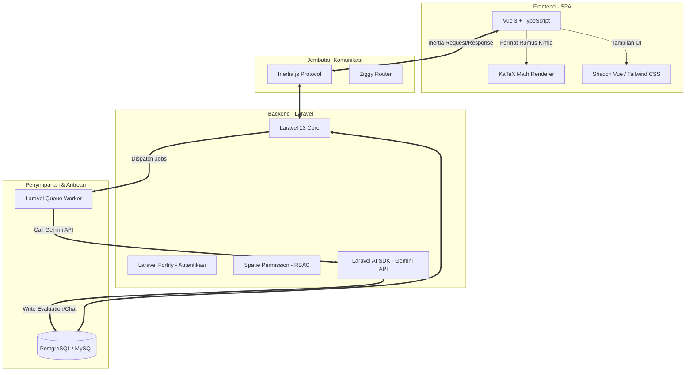
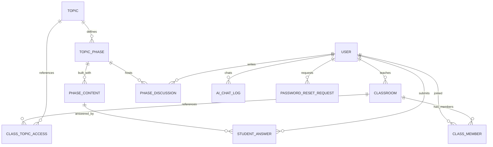

# 🧪 Dokumentasi Lengkap Sistem: ElementVerse LMS

ElementVerse LMS adalah platform **Learning Management System (LMS)** interaktif yang dirancang khusus untuk pembelajaran Ilmu Kimia tingkat Sekolah Menengah Atas (SMA). Berbeda dengan LMS generik lainnya, ElementVerse mengintegrasikan model pembelajaran berbasis siklus **POE (Predict, Observe, Explain)** dan didukung oleh **Kecerdasan Buatan (AI)** melalui **Google Gemini 2.5 Flash** untuk memfasilitasi evaluasi jawaban otomatis dan asisten belajar (tutor pribadi) bagi siswa.

Dokumen ini disusun untuk memberikan pemahaman teknis dan konseptual yang sangat mendalam mengenai arsitektur sistem, struktur database, alur kerja peran pengguna, integrasi AI, serta mekanisme keamanan yang diterapkan pada proyek ElementVerse LMS.

---

## 1. Landasan Pedagogis & Model Pembelajaran POE

ElementVerse dirancang di atas landasan model pembelajaran **POE (Predict, Observe, Explain)**. Model ini memandu siswa untuk membangun pemahaman konsep kimia mereka sendiri secara aktif melalui tiga fase berurutan:

1. **Predict (Prediksi)**:
   - **Tujuan**: Menggali pengetahuan awal siswa, mendeteksi miskonsepsi awal, dan merangsang nalar analitis/hipotesis siswa terhadap fenomena kimia tertentu.
   - **Implementasi**: Guru menyajikan stimulus berupa demonstrasi fenomena kimia menarik (misalnya visualisasi video/gambar). Siswa menuliskan prediksi awal mereka dalam kolom jawaban beserta alasan ilmiahnya.

2. **Observe (Observasi)**:
   - **Tujuan**: Membimbing siswa melakukan investigasi empiris, pengamatan terarah, dan pengumpulan fakta/data reaksi kimia secara akurat.
   - **Implementasi**: Siswa mengamati simulasi interaktif, menonton kelanjutan video demonstrasi reaksi kimia secara detail, atau mengumpulkan data dari literatur ilmiah.

3. **Explain (Penjelasan/Eksplanasi)**:
   - **Tujuan**: Membandingkan prediksi awal dengan hasil observasi nyata untuk merumuskan penjelasan konseptual kimia yang benar.
   - **Implementasi**: Siswa menuliskan kesimpulan penjelasan mereka, didampingi oleh evaluasi otomatis AI dan penjelasan materi formal yang tersemat dalam sistem.
ru.

---

## 2. Arsitektur Teknologi & Tech Stack

Aplikasi ElementVerse dibangun menggunakan arsitektur modern berbasis **Single Page Application (SPA)** tanpa overhead pembuatan API terpisah, berkat jembatan Inertia.js.



### Rincian Stack Teknologi
*   **Backend Framework**: **Laravel 13 (PHP 8.3+)**. Dipilih karena kestabilan sistem routing, database migration, model Eloquent, serta dukungan *Queued Background Jobs* yang kokoh.
*   **Frontend Framework**: **Vue 3 (Composition API)** + **TypeScript**. Menyediakan antarmuka dinamis dan *reactive state management* demi kenyamanan siswa saat mengerjakan lembar kerja atau menggunakan chatbot.
*   **Jembatan Interaksi (SPA Bridge)**: **Inertia.js** & **Ziggy** (untuk memetakan rute Laravel langsung di dalam JavaScript).
*   **Sistem Autentikasi**: **Laravel Fortify** yang disesuaikan secara khusus untuk mendukung mekanisme *two-factor authentication* serta alur reset password berbasis persetujuan admin.
*   **Otorisasi & Keamanan**: **Spatie Laravel Permission** untuk mengelola hak akses berbasis peran (RBAC).
*   **Integrasi AI**: **Laravel AI SDK** yang terhubung langsung ke **Google Gemini 2.5 Flash** untuk pemrosesan agen kecerdasan buatan.
*   **Gaya & Desain Visual**: **Tailwind CSS**, **Shadcn-vue**, dan **Lucide Icons** untuk menghasilkan desain antarmuka bergaya premium, profesional, dan responsif.
*   **Rendering Rumus Kimia**: **KaTeX** terintegrasi untuk menampilkan simbol-simbol kimia, persamaan reaksi, dan rumus matematika secara akurat di sisi klien.

---

## 3. Skema Database & Relasi Model (Database Schema)

ElementVerse memiliki struktur database relasional yang dirancang untuk mendukung dinamisme *Content Builder* guru serta pencatatan respon siswa yang rapi. Berikut adalah model-model utama dan deskripsi fungsinya:



### Penjelasan Detail Model & Tabel

1.  **`User` (Tabel: `users`)**
    *   Menyimpan kredensial pengguna (nama, email, password).
    *   Telah ditambahkan kolom autentikasi dua faktor (`two_factor_secret`, `two_factor_recovery_codes`) melalui integrasi Laravel Fortify.
    *   Memiliki peran (`role`) melalui relasi Spatie (`ADMIN`, `GURU`, `SISWA`).

2.  **`Classroom` (Tabel: `classrooms`)**
    *   Mewakili ruang kelas virtual.
    *   Atribut penting: `class_name` (nama kelas), `class_code` (kode kelas acak sepanjang 6 karakter untuk pendaftaran siswa), dan `teacher_id` (foreign key yang merujuk ke tabel `users` sebagai pembuat kelas).

3.  **`ClassMember` (Tabel: `class_members`)**
    *   Tabel pivot yang menghubungkan `users` (siswa) dengan `classrooms`.
    *   Menyimpan progres evaluasi siswa lewat kolom boolean:
        *   `is_evaluation_finished`: Bernilai `true` jika guru telah merampungkan seluruh penilaian manual/AI untuk siswa tersebut.
        *   `is_evaluation_sent`: Bernilai `true` jika umpan balik dan nilai akhir telah resmi dikirimkan ke siswa.
    *   Menyimpan nilai kuantitatif:
        *   `pre_test_score`: Nilai asesmen awal sebelum siswa mempelajari materi.
        *   `post_test_score`: Nilai asesmen akhir setelah siswa menyelesaikan pengerjaan.

4.  **`Topic` (Tabel: `topics`)**
    *   Merupakan unit materi/bab besar pembelajaran kimia (misal: "Kesetimbangan Kimia").
    *   Dihubungkan ke kelas melalui tabel pivot `class_topic_accesses` untuk mengatur status publikasi (`is_published`), sehingga materi dapat dibuat dalam status *Draft* terlebih dahulu oleh Guru sebelum dirilis ke Siswa.

5.  **`TopicPhase` (Tabel: `topic_phases`)**
    *   Merepresentasikan fase-fase di dalam suatu Topik berdasarkan alur LC5E.
    *   Atribut penting: `name` (nama fase), `order` (urutan fase, 1-5), `is_ai_enabled` (apakah jawaban esai di fase ini dievaluasi otomatis oleh AI), `is_chatbot_enabled` (apakah chatbot tutor diaktifkan untuk fase ini), `ai_prompt_setting` (instruksi kustom guru untuk penilaian AI), dan `chatbot_prompt_setting` (instruksi kustom guru untuk perilaku chatbot).

6.  **`PhaseContent` (Tabel: `phase_contents`)**
    *   Blok konten dinamis yang menyusun materi di dalam fase.
    *   Atribut utama:
        *   `type`: Jenis blok konten (`text`, `video`, `eval_mcq` [pilihan ganda], `eval_cmcq` [pilihan ganda kompleks], `eval_short` [isian singkat], `eval_essay` [esai], `eval_file` [unggah gambar/pdf], `discussion`).
        *   `content_data` (Cast: `array`): Menyimpan data JSON berisi isi teks kaya, URL video, pertanyaan soal, opsi pilihan ganda, atau parameter blok lainnya.
        *   `correct_answers` (Cast: `array`): Menyimpan kunci jawaban yang benar (indeks opsi atau string jawaban) untuk dicocokkan.
        *   `order`: Posisi urutan penampilan blok pada lembar kerja siswa.

7.  **`StudentAnswer` (Tabel: `student_answers`)**
    *   Menampung jawaban yang diinputkan oleh siswa per blok pertanyaan (`content_id`).
    *   Atribut utama:
        *   `answer_data`: Isi jawaban siswa (berupa teks esai, pilihan indeks opsi, atau path file unggahan).
        *   `ai_feedback`: Hasil evaluasi, komentar, atau nilai koreksi yang diberikan secara asinkron oleh agen AI.
        *   `is_locked` (Boolean): Mengunci jawaban siswa agar tidak dapat disunting kembali setelah fase dinyatakan selesai dikerjakan (`completePhase`) atau setelah guru mulai menilai.
    *   Memiliki kekangan kunci unik gabungan (`unique(['user_id', 'content_id'])`) untuk mencegah terjadinya duplikasi baris jawaban siswa untuk satu pertanyaan yang sama.

8.  **`PhaseDiscussion` (Tabel: `phase_discussions`)**
    *   Menampung forum diskusi interaktif antar siswa dan guru yang terjadi secara real-time pada fase tertentu.
    *   Mengimplementasikan relasi hierarkis mandiri lewat kolom `parent_id` (foreign key yang merujuk ke tabel `phase_discussions` itu sendiri) untuk mendukung fitur balasan komentar (*threaded replies*).

9.  **`AiChatLog` (Tabel: `ai_chat_logs`)**
    *   Mencatat riwayat percakapan antara siswa dan chatbot tutor.
    *   Atribut penting: `prompt` (pertanyaan siswa), `response` (jawaban chatbot AI), dan `topic_id`/`phase_id` sebagai konteks pembelajaran. Riwayat ini dapat dibaca oleh Guru untuk memantau kesulitan belajar siswa.

10. **`PasswordResetRequest` (Tabel: `password_reset_requests`)**
    *   Mengelola permintaan lupa password secara manual yang membutuhkan otorisasi admin.
    *   Atribut utama: `user_id` (peminta), `token` (kunci acak sepanjang 64 karakter), dan `status` (`pending` [menunggu persetujuan], `approved` [disetujui, siap ganti password], `rejected` [ditolak], `completed` [password berhasil diubah]).

---

## 4. Alur Kerja Pengguna Berdasarkan Peran (Roles & Workflows)

ElementVerse LMS mengimplementasikan tiga peran pengguna dengan batasan izin akses yang ketat:

### A. Peran: Superadmin
*   **Tujuan Peran**: Menjaga stabilitas platform, melakukan administrasi pengguna, dan memverifikasi identitas pengguna yang meminta pemulihan password.
*   **Alur Kerja**:
    1.  **Dashboard Utama**: Memantau statistik global berupa total pengguna terdaftar, total ruang kelas aktif, serta daftar request reset password terbaru.
    2.  **Manajemen Pengguna**: Mengakses menu kelola user, melakukan pembuatan/penghapusan akun, serta menaikkan status peran akun tertentu (misalnya, menaikkan peran pengguna biasa menjadi `GURU`).
    3.  **Verifikasi Password**: Membuka antrean permintaan reset password, meninjau permohonan siswa atau guru yang lupa password, kemudian melakukan aksi *Approve* (menyetujui) atau *Reject* (menolak).

### B. Peran: Guru (Teacher)
*   **Tujuan Peran**: Mengelola kelas pembelajaran, mendesain lembar kerja interaktif berbasis POE, mengonfigurasi kecerdasan buatan, serta memantau dan memvalidasi hasil belajar siswa.
*   **Alur Kerja**:
    1.  **Pembuatan Kelas**: Guru membuat kelas baru dan mendapatkan kode kelas (misal: `X-KIMIA`). Kode ini diberikan kepada siswa agar mereka dapat bergabung.
    2.  **Desain Materi (Content Builder)**:
        *   Guru membuat Topik Baru.
        *   Guru masuk ke *Phase Builder* untuk merancang konten di 5 Fase LC5E.
        *   Guru menambah blok konten dinamis (Teks materi, Video dari URL, Soal MCQ, Soal Esai, atau Forum Diskusi) dan mengatur urutannya dengan sistem drag/builder.
    3.  **Kustomisasi Agen AI**:
        *   Di setiap fase, Guru dapat mencentang opsi **AI Assistant Feedback** dan menuliskan instruksi khusus evaluasi (misal: *"Nilailah dengan menekankan pentingnya penulisan fase zat (s, l, aq, g) dalam persamaan reaksi"*).
        *   Guru juga dapat mengaktifkan **Chatbot AI** per fase dan menuliskan arahan khusus bagi chatbot dalam berinteraksi dengan siswa (misal: *"Gunakan analogi kehidupan sehari-hari dan jangan berikan jawaban langsung, melainkan pandu siswa berpikir"*).
    4.  **Penilaian & Validasi**:
        *   Setelah siswa mengirimkan lembar kerja, Guru masuk ke panel rekap jawaban kelas.
        *   Guru melihat draf umpan balik yang dihasilkan oleh AI secara otomatis untuk jawaban esai siswa.
        *   Guru dapat merevisi skor/feedback AI secara manual jika dirasa kurang akurat.
        *   Guru mengklik tombol **Finish Evaluation** untuk mengunci penilaian dan **Send Evaluation** untuk mempublikasikan nilai tersebut ke dasbor siswa.
    5.  **Pelaporan**: Guru mengekspor seluruh nilai siswa dalam satu klik ke format Excel/CSV, atau mengunduh log obrolan AI siswa ke format PDF untuk keperluan analisis perilaku belajar.

### C. Peran: Siswa (Student)
*   **Tujuan Peran**: Belajar secara interaktif sesuai siklus LC5E, berkonsultasi dengan chatbot tutor ketika menghadapi kendala, berdiskusi dengan rekan kelas, dan mengevaluasi pemahaman diri.
*   **Alur Kerja**:
    1.  **Registrasi & Masuk Kelas**: Siswa mendaftar akun secara mandiri dan menginputkan kode kelas yang diberikan Guru untuk terdaftar sebagai anggota.
    2.  **Pengerjaan Lembar Kerja**:
        *   Siswa membuka materi topik aktif. Mereka harus menavigasi fase satu per satu secara berurutan.
        *   Siswa mempelajari materi teks, menonton video, dan mengisi kolom-kolom pertanyaan (baik pilihan ganda, isian, esai, maupun unggahan gambar hasil praktikum).
        *   Setiap kali menyimpan jawaban esai, sistem secara asinkron memicu evaluasi AI di latar belakang. Siswa akan langsung melihat umpan balik AI di samping kolom jawabannya sebagai pemandu belajar mandiri.
    3.  **Konsultasi AI Chatbot**:
        *   Jika siswa bingung terhadap materi di fase tersebut, mereka dapat membuka jendela chatbot tutor.
        *   Chatbot diprogram untuk hanya menjawab pertanyaan seputar materi kimia terkait dan mematuhi batas panduan yang dipasang oleh Guru.
    4.  **Kolaborasi & Diskusi**: Siswa mengajukan pertanyaan atau menjawab tanggapan teman sekelas pada forum diskusi di setiap fase.
    5.  **Menyelesaikan Pembelajaran**: Setelah semua tugas dijawab, siswa menekan tombol **Complete Phase** untuk mengunci lembar kerja mereka dan menunggu penilaian final dari guru.

---

## 5. Mekanisme Integrasi Kecerdasan Buatan (AI Integration Pipeline)

ElementVerse LMS mengoptimalkan integrasi kecerdasan buatan dengan memisahkan pemanggilan API eksternal dari thread HTTP utama. Hal ini dilakukan demi mencegah terjadinya *timeout* aplikasi dan mengelola batas kuota (*rate limit*) API.

### Pipeline Evaluasi Jawaban Otomatis

```
[Siswa Menyimpan Jawaban]
         │
         ▼
[Controller Memeriksa Setelan Fase] ─── AI Nonaktif ───► [Simpan Jawaban ke Database]
         │
     AI Aktif
         │
         ▼
[Dispatch: EvaluateStudentAnswerJob]
         │
         ▼ (Masuk ke Antrean/Queue)
[Queue Worker Mengeksekusi Job]
         │
         ▼
[Inisialisasi StudentAnswerEvaluatorAgent] ◄─── Ambil Kustom Prompt Guru
         │
         ▼
[Kirim Prompt ke Gemini 2.5 Flash]
         │
 ┌───────┴────────────────────────┐
 │                                │
Sukses                         Rate Limit (429/503)
 │                                │
 ▼                                ▼
[Update Kolom 'ai_feedback']   [Release/Tunda Job 60 Detik & Ulangi]
```

### Kode Utama Job AI (`EvaluateStudentAnswerJob.php`)
Ketika siswa menyimpan jawaban esai, job dikirim ke antrean dengan toleransi retry tinggi (`$tries = 50`) untuk menjamin semua pengerjaan siswa pasti dievaluasi meskipun kuota Gemini API sedang padat:

```php
try {
    $response = (new StudentAnswerEvaluatorAgent($this->systemPrompt))
        ->prompt($userMessage);

    if ($response) {
        $this->answer->update([
            'ai_feedback' => (string) $response,
        ]);
    }
} catch (\Exception $e) {
    $errorMessage = $e->getMessage();

    // Deteksi jika server Gemini mengalami overload atau kuota habis sementara
    if (str_contains($errorMessage, '429') || str_contains($errorMessage, '503') || str_contains($errorMessage, 'overloaded') || str_contains($errorMessage, 'quota')) {
        Log::warning('Gemini rate limit tercapai. Menunda antrean selama 60 detik...');
        $this->release(60); // Masukkan kembali ke antrean dengan delay 60 detik
        return;
    }

    Log::error('StudentAnswerEvaluatorAgent Exception: '.$errorMessage);
    throw $e;
}
```

### Konfigurasi Perilaku Agen AI
Sistem menerapkan dua agen AI khusus dengan instruksi sistem bawaan yang kokoh:

1.  **`StudentAnswerEvaluatorAgent`**:
    *   **Peran**: Guru kimia objektif yang mengoreksi jawaban siswa.
    *   **Instruksi**: Memberikan analisis kesalahan konsep (miskonsepsi), membandingkan jawaban dengan fakta ilmiah, serta memberikan saran perbaikan yang konstruktif. Perilaku ini dapat diperluas secara dinamis dengan parameter instruksi kustom yang ditulis guru.
2.  **`ChemistryTutorAgent`**:
    *   **Peran**: Asisten guru/Tutor sebaya yang ramah untuk siswa SMA.
    *   **Instruksi Sistem (Aturan Mutlak)**:
        *   Hanya boleh menjawab hal yang relevan dengan topik kimia aktif.
        *   Jika siswa bertanya di luar topik kimia (misal: pemrograman, video game, gosip artis), agen **wajib menolaknya secara halus** dan mengarahkan kembali siswa ke konteks pelajaran.
        *   Mematuhi arahan kustom guru (seperti: bertindak ala metode socrates, menyajikan persamaan reaksi kimia, dll.).

---

## 6. Fitur Keamanan Khusus & Manajemen Reset Password

Selain menerapkan RBAC standar, EduChem dirancang untuk lingkungan sekolah yang sering kali menghadapi kendala siswa lupa password tanpa memiliki akses kotak masuk email pribadi yang memadai (atau server mail SMTP sekolah yang tidak aktif).

### Alur Lupa Password dengan Persetujuan Admin (Admin Approval Reset)

Sistem ini menggantikan pengiriman tautan email lupa password standar dengan sistem antrean persetujuan admin lokal:

```
[Siswa Klik 'Lupa Password'] 
         │
         ▼
[Siswa Input Email Akun]
         │
         ▼ (Sistem memvalidasi & membuat request status 'pending')
[Redirect ke Halaman Menunggu - auth/ForgotPasswordWaiting]
         │
         ├──► [Halaman Polling ke API: /forgot-password/status/{token} setiap 5 detik]
         │
[Admin Membuka Panel 'Password Resets' di Dasbor Admin]
         │
         ├─── Ditolak (Reject) ───► [Status request menjadi 'rejected' & Polling Siswa Berhenti]
         │
    Disetujui (Approve)
         │
         ▼ (Status request menjadi 'approved')
[Halaman Polling Siswa Mendeteksi Perubahan Status]
         │
         ▼ (Menampilkan form input password baru pada layar siswa)
[Siswa Input Password Baru & Konfirmasi]
         │
         ▼ (Sistem mengubah hash password di DB & ubah status request menjadi 'completed')
[Siswa Berhasil Login dengan Password Baru]
```

### Masa Kedaluwarsa Keamanan (Expiration Guard)
Permintaan reset password dibatasi secara ketat oleh waktu. Baik pada endpoint polling maupun proses penyimpanan password baru, sistem selalu memeriksa waktu pembuatan permintaan:
```php
// Batas kedaluwarsa 30 menit
if ($resetRequest->created_at->addMinutes(30)->isPast()) {
    $resetRequest->update(['status' => 'rejected']);
    return back()->withErrors([
        'password' => 'Sesi reset password Anda telah kedaluwarsa (lebih dari 30 menit). Silakan ajukan ulang.',
    ]);
}
```
Metode ini memastikan token reset sepanjang 64 karakter acak tidak dapat disalahgunakan di kemudian hari.

---

## 7. Peta Direktori Proyek (Project Directory Map)

Berikut adalah panduan navigasi ke file-file kritis dalam repositori EduChem LMS untuk membantu pengembang memahami struktur kode sumber secara mendalam:

```
elementverse/
├── app/
│   ├── Ai/
│   │   └── Agents/
│   │       ├── ChemistryTutorAgent.php            # Sistem instruksi chatbot tutor AI
│   │       └── StudentAnswerEvaluatorAgent.php     # Agen penilai jawaban esai siswa
│   ├── Http/
│   │   ├── Controllers/
│   │   │   ├── Admin/
│   │   │   │   ├── DashboardController.php       # Controller visualisasi data admin
│   │   │   │   └── UserController.php            # CRUD user & hak akses kelas
│   │   │   │   └── AdminPasswordResetManagementController.php # Persetujuan reset password oleh Admin
│   │   │   ├── Auth/
│   │   │   │   └── AdminApprovalPasswordResetController.php   # Alur request & polling lupa password
│   │   │   ├── Guru/
│   │   │   │   ├── DashboardController.php       # Manajemen kelas oleh Guru
│   │   │   │   ├── TopicController.php           # Publikasi topik per kelas
│   │   │   │   ├── PhaseController.php           # Pengelolaan fase POE & konten builder
│   │   │   │   └── StudentAnswerController.php   # Penilaian esai manual, pemicuan AI, & ekspor
│   │   │   └── Siswa/
│   │   │       ├── DashboardController.php       # Progress tracking siswa di dasbor
│   │   │       ├── WorksheetController.php       # Halaman belajar interaktif & logic penguncian
│   │   │       ├── ChatbotController.php         # Endpoint obrolan AI tutor siswa
│   │   │       └── DiscussionController.php      # Forum tanya jawab siswa per fase
│   ├── Jobs/
│   │   ├── EvaluateStudentAnswerJob.php          # Pekerjaan latar belakang penilaian esai oleh AI
│   │   └── ProcessAiChatJob.php                  # Pekerjaan latar belakang obrolan chatbot AI
│   ├── Models/
│   │   ├── Classroom.php                         # Model kelas virtual
│   │   ├── ClassMember.php                       # Model keanggotaan kelas, pre/post-score
│   │   ├── Topic.php                             # Model materi pokok
│   │   ├── TopicPhase.php                        # Model fase siklus POE
│   │   ├── PhaseContent.php                      # Model blok konten builder
│   │   ├── StudentAnswer.php                     # Model respon jawaban siswa & lock status
│   │   ├── PhaseDiscussion.php                   # Model forum diskusi threaded
│   │   ├── AiChatLog.php                         # Model log chat AI
│   │   └── PasswordResetRequest.php              # Model permohonan reset password admin-approved
│   └── Services/
│       ├── PhaseService.php                      # Logika bisnis manipulasi fase & konten
│       └── UserService.php                       # Logika bisnis pembuatan & update profil user
├── config/
│   ├── ai.php                                    # Konfigurasi engine AI & driver SDK
│   └── permission.php                            # Konfigurasi Spatie Laravel Permission
├── database/
│   ├── migrations/                               # Berkas skema tabel database
│   └── seeders/                                  # Pengisi data contoh awal (guru, siswa, admin)
├── resources/
│   ├── js/
│   │   ├── components/                           # Komponen UI global (Rich Text Editor, dll.)
│   │   ├── layouts/                              # Layout menu samping & atas berdasarkan peran
│   │   └── pages/
│   │       ├── Admin/
│   │       │   ├── Dashboard.vue                 # Halaman dasbor statistik administrator
│   │       │   └── PasswordResets.vue            # Panel kelola & persetujuan reset password
│   │       ├── Guru/
│   │       │   ├── Classes/                      # Panel kelola kelas & siswa terdaftar
│   │       │   ├── Dashboard.vue                 # Tampilan dasbor rekapitulasi guru
│   │       │   ├── Phases/
│   │       │   │   └── Show.vue                  # Antarmuka DYNAMIC CONTENT BUILDER fase POE
│   │       │   └── StudentAnswers/
│   │       │       └── Show.vue                  # Panel koreksi guru & validasi feedback AI
│   │       └── Siswa/
│   │           ├── Dashboard.vue                 # Progress bar pembelajaran siswa
│   │           └── Worksheet/
│   │               └── Show.vue                  # Tampilan lembar kerja belajar interaktif POE
└── routes/
    └── web.php                                   # Pemetaan rute URL aplikasi & middleware guard
```

---

## 8. Panduan Teknis & Pengoperasian untuk Pengembang

Untuk menjalankan proyek ini secara lokal, pengembang harus menyelaraskan konfigurasi backend dan frontend agar berjalan beriringan secara asinkron.

### Variabel Lingkungan Penting (`.env`)
Pastikan file `.env` diisi dengan konfigurasi database yang valid dan kunci API kecerdasan buatan dari Google AI Studio:

```env
# Koneksi Database (sesuaikan port & nama DB)
DB_CONNECTION=pgsql
DB_HOST=127.0.0.1
DB_PORT=5432
DB_DATABASE=elementverse
DB_USERNAME=postgres
DB_PASSWORD=secret

# Driver Antrean (wajib bernilai database agar Job AI tidak memblokir aplikasi)
QUEUE_CONNECTION=database

# Konfigurasi Google Gemini API
AI_DEFAULT_PROVIDER=gemini
GEMINI_API_KEY=AIzaSyA1...your_actual_gemini_api_key...
AI_GEMINI_MODEL=gemini-2.5-flash
```

### Langkah Setup Awal (Lokal)
Jalankan rangkaian perintah berikut di terminal setelah meng-clone repositori:

1.  **Instalasi Dependensi PHP & JS**:
    ```bash
    composer install
    pnpm install # atau npm install
    ```
2.  **Pembuatan Aplikasi Key & Tautan Direktori Media**:
    ```bash
    php artisan key:generate
    php artisan storage:link
    ```
3.  **Inisialisasi Database & Seeder**:
    ```bash
    php artisan migrate:fresh --seed
    ```
4.  **Menjalankan Server secara Simultan**:
    Gunakan perintah bawaan composer yang telah dikonfigurasi menggunakan utilitas `concurrently` untuk memicu server Laravel, queue worker, linter, dan Vite dev server secara bersamaan hanya dengan 1 baris perintah:
    ```bash
    pnpm dev # atau npm run dev
    ```

### Pentingnya Menjalankan Queue Worker
Fitur AI (evaluasi jawaban otomatis dan chatbot) **TIDAK AKAN BERJALAN** apabila queue worker tidak diaktifkan. Hal ini dikarenakan setiap aktivitas pengiriman esai atau chat dikirimkan ke tabel `jobs` terlebih dahulu. Jalankan perintah berikut jika Anda ingin menjalankan queue secara terpisah:
```bash
php artisan queue:work --timeout=120
```

---

## 9. Quality Assurance & Pengujian Kode

Aplikasi ini dilengkapi dengan standardisasi penulisan kode untuk memastikan skalabilitas proyek jangka panjang:

*   **Linter & Formatter PHP**: Menggunakan **Laravel Pint** untuk menyelaraskan format kode PHP sesuai standar PSR-12.
    ```bash
    php artisan pint
    ```
*   **Linter JS/TS**: Menggunakan **ESLint** untuk merapikan kode Vue 3 dan TypeScript.
    ```bash
    npm run lint
    ```
*   **Pengujian Otomatis**: Dilengkapi dengan test suite berbasis **PHPUnit** untuk menguji validasi rute, role middleware, logika simpan jawaban siswa, serta alur approval reset password.
    ```bash
    php artisan test
    ```

---
*Dokumen ini diperbarui secara berkala sesuai perkembangan fitur ElementVerse LMS.*
